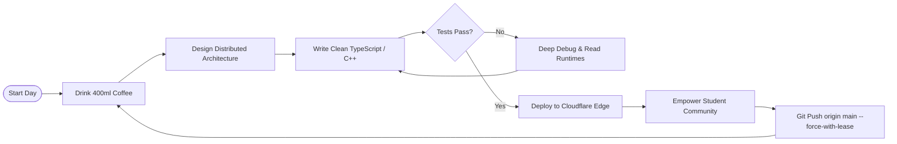

<div align="center">

  <!-- TOP ANIMATED BANNER -->
  

  <!-- DYNAMIC TYPING SVG -->
  <a href="https://github.com/itsmeaadeesh">
    
  </a>

  <br/>

  <!-- BADGES / SOCIALS RIBBON -->
  <p align="center">
    <a href="https://linkedin.com/in/itsmeaadeesh" target="_blank">
      
    </a>
    <a href="https://x.com/itsmeaadeesh" target="_blank">
      
    </a>
    <a href="mailto:itsmeaadeesh@gmail.com">
      
    </a>
    <a href="https://github.com/itsmeaadeesh?tab=repositories">
      
    </a>
    <a href="https://komarev.com/ghpvc/?username=itsmeaadeesh&label=PROFILE+VIEWS&color=00f2fe&style=for-the-badge">
      
    </a>
  </p>

  <!-- QUICK STATUS PILL -->
  <p align="center">
    
    
    
  </p>

</div>

---

### ⚡ System Telemetry (`whoami.sh`)

```bash
┌──(aadeesh㉿nexus)-[~]
└─$ neofetch --profile
```

```yaml
  User        : Aadeesh Jain (itsmeaadeesh)
  Role        : Software Engineer & Full-Stack / Systems Craftsman
  Accolades   : 🥇 National #1 Google Student Ambassador (Top of ~11,000 applicants across India)
                ⚡ Founder & Campus Lead @ Microsoft Campus Club (GGITS)
                🎯 Regional Mentor @ Google Solution Challenge
                🏆 UiPath Student Champion | Core Technical Lead @ GDGoC
  Impact      : 50+ Hands-on Technical Workshops | 10,000+ Developers Reached | 1,200+ Campus Members
  Focus Tech  : React 19 • TanStack Start • Gemini 2.5 • Supabase • Cloudflare Workers • Python • C++
  Architecture: High-throughput edge backends, agentic workflow automation, interactive 3D interfaces
  Uptime      : 20+ Years, 99.999% Caffeine Availability
  Status      : [ONLINE] Exploring High-Impact Engineering Roles & Distributed Systems
```

---

### 🏆 Hall of Trophies

<div align="center">
  <a href="https://github.com/itsmeaadeesh">
    
  </a>
</div>

---

### 🛠️ The Arsenal & Battle Station

<table align="center" width="100%">
  <tr>
    <td width="25%" valign="top">
      <b>Core Languages</b><br/><br/>
      
    </td>
    <td width="25%" valign="top">
      <b>Frontend & 3D UI</b><br/><br/>
      
    </td>
    <td width="25%" valign="top">
      <b>Cloud, Edge & DB</b><br/><br/>
      
    </td>
    <td width="25%" valign="top">
      <b>AI, Automation & Tools</b><br/><br/>
      
    </td>
  </tr>
</table>

> **Key Specialties:** `Gemini 2.5 API` • `Playwright Headless Automation` • `ReportLab Document Engine` • `Vector RAG Pipelines` • `Cloudflare V8 Isolates`

---

### 🚀 Flagship Deployments & Innovations

<table>
  <tr>
    <td width="50%" valign="top">
      <h3>🧠 <a href="https://github.com/itsmeaadeesh/skill-setu">Skill Setu</a></h3>
      
      
      
      <br/><br/>
      <b>AI-Driven Competency Intelligence & Dynamic Curriculum Vector Mapping.</b>
      <ul>
        <li>Ingests live industry hiring telemetry & maps real-time market requirements to academic syllabi.</li>
        <li>Generates adaptive learning pathways & automated code review evaluations via <b>Gemini 2.5</b>.</li>
        <li>Sub-second syllabus gap queries optimized with Cloudflare Edge Workers & vector embeddings.</li>
      </ul>
    </td>
    <td width="50%" valign="top">
      <h3>⚡ <a href="https://github.com/itsmeaadeesh/ambassador-playbook">Ambassador Playbook</a></h3>
      
      
      
      <br/><br/>
      <b>Open-Source Operational Engine for Campus Tech Ambassadors & Guilds.</b>
      <ul>
        <li>Comprehensive event blueprints, cloud lab scripts, and automated attendee feedback pipelines.</li>
        <li>Adopted across <b>30+ university chapters</b>; slashed workshop prep turnaround by <b>75%</b>.</li>
        <li>Instant edge-delivered static architectures with zero latency global caching.</li>
      </ul>
    </td>
  </tr>
  <tr>
    <td width="50%" valign="top">
      <h3>📊 <a href="https://github.com/itsmeaadeesh/gsa-linkedin-hub">GSA LinkedIn Hub</a></h3>
      
      
      
      <br/><br/>
      <b>Autonomous Social Telemetry & Executive Event Dossier Generator.</b>
      <ul>
        <li>Headless Playwright scraper tracking engagement metrics across 50+ event campaigns.</li>
        <li>Synthesizes takeaways via Gemini 2.5 and outputs publication-grade PDF reports in &lt;4s.</li>
        <li>Saved 6+ hours weekly of tedious manual community reporting overhead.</li>
      </ul>
    </td>
    <td width="50%" valign="top">
      <h3>🎬 <a href="https://github.com/itsmeaadeesh/gsa-reels-studio">GSA Reels Studio</a></h3>
      
      
      
      <br/><br/>
      <b>AI Code-Motion Templater & Kinetic Tech Short-Form Generator.</b>
      <ul>
        <li>Transforms algorithmic markdown into syntax-highlighted kinetic 3D scenes.</li>
        <li>Auto-synthesizes voiceover scripts with Gemini 2.5 and precision millisecond sync.</li>
        <li>Powers viral micro-learning developer clips garnering 100k+ organic views.</li>
      </ul>
    </td>
  </tr>
</table>

---

### 📊 Real-Time Matrix Telemetry

<div align="center">

  <!-- ROW 1: STREAK & STATS -->
  <p align="center">
    <a href="https://github.com/itsmeaadeesh">
      
    </a>
    <a href="https://github.com/itsmeaadeesh">
      
    </a>
  </p>

  <!-- ROW 2: TOP LANGUAGES -->
  <p align="center">
    <a href="https://github.com/itsmeaadeesh">
      
    </a>
  </p>

</div>

---

### 🐍 Contribution Arena: The Commit Grazer

<div align="center">
  
</div>

---

### 🎮 Easter Eggs, Terminal Wisdom & Lore

<details>
  <summary><b>☕ View the Infinite Dev Loop (Runtime Algorithm)</b></summary>
  <br/>


</details>

<details>
  <summary><b>🎧 Sonic Frequencies (What I code to)</b></summary>
  <br/>

- **Cyberpunk Darkwave / Synthwave** — For intense low-level C++ & distributed systems debugging.
- **Lofi Hip-Hop & Ambient Atmospheric** — For architecting UI states, Three.js shaders & component trees.
- **Progressive Electronic** — For high-speed hackathons and campus sprint sessions.
</details>

<details>
  <summary><b>💬 Random Developer Wisdom Generator</b></summary>
  <br/>

  <div align="center">
    
  </div>
</details>

---

<div align="center">

  <!-- INVITATION -->
  <h3>🤝 Let's Build Something Monumental</h3>
  <p>
    Whether you want to discuss <b>distributed systems, AI agents, edge computing, campus developer ecosystems</b>,<br/>
    or explore <b>internship & collaboration opportunities</b> — my inbox is always open.
  </p>

  <p>
    <a href="mailto:itsmeaadeesh@gmail.com">
      
    </a>
    &nbsp;&nbsp;
    <a href="https://linkedin.com/in/itsmeaadeesh">
      
    </a>
  </p>

  <br/>

  <!-- BOTTOM ANIMATED FOOTER -->
  

</div>
